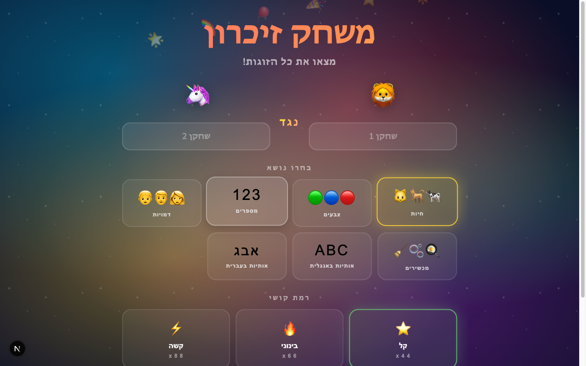
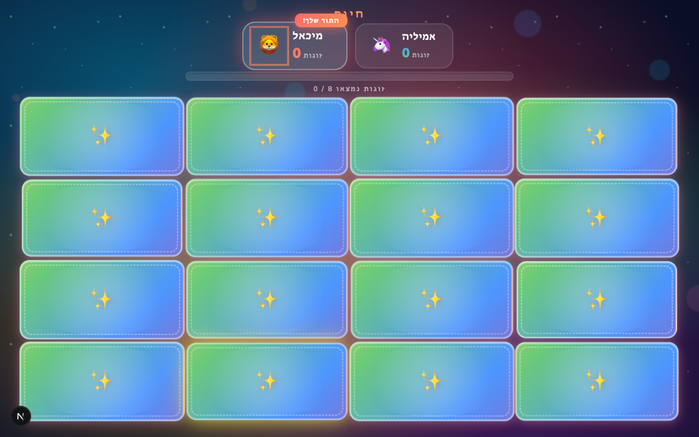
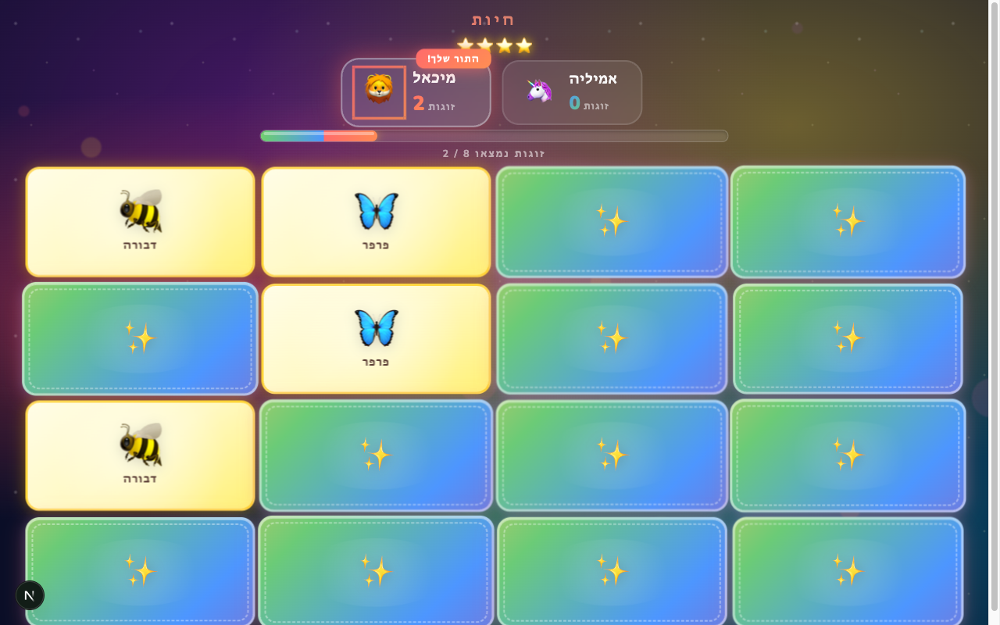

# Kids Memory Game

A colorful, interactive memory card game for kids (ages 3-7), built with Next.js, React, and TypeScript. Full Hebrew UI.

## Features

- **Two-player mode** with turn-based gameplay
- **7 themes**: Animals, Colors, Numbers, Characters, Appliances, English Letters, Hebrew Letters
- **3 difficulty levels**: Easy (4x4), Medium (6x6), Hard (8x8)
- **Card peek** countdown before play begins
- **3D flip animations**, confetti, combo streaks, and sound effects
- **Voice announcements** via Web Speech API (Hebrew)

## Screenshots

### Setup Screen
Pick players, theme, and difficulty:



### Game Board
Cards face-down, ready to play:



### Gameplay
Matched pairs stay revealed:



## Getting Started

```bash
npm install
npm run dev
```

Open [http://localhost:3000](http://localhost:3000).

## Tech Stack

- Next.js 16 (App Router)
- React 19
- TypeScript
- CSS Modules + pure CSS animations
- Web Speech API for audio
